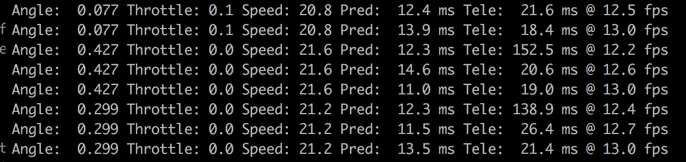
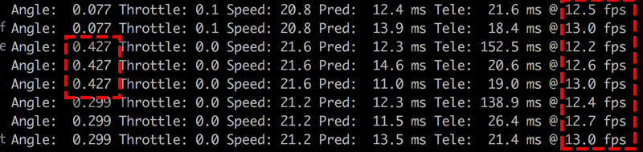
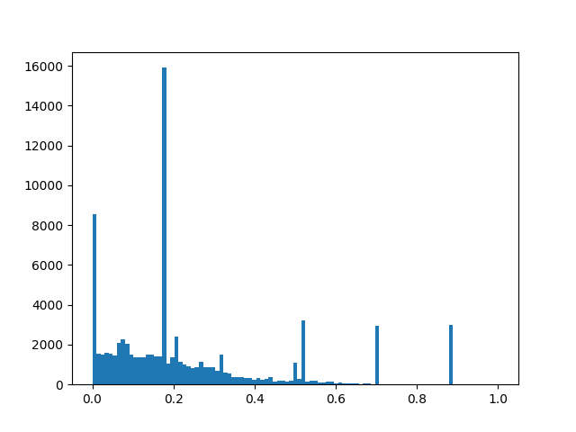
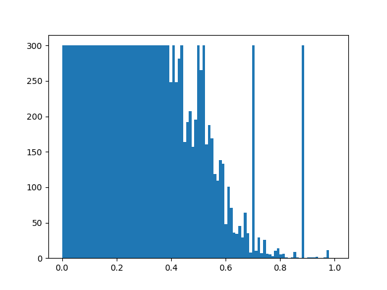
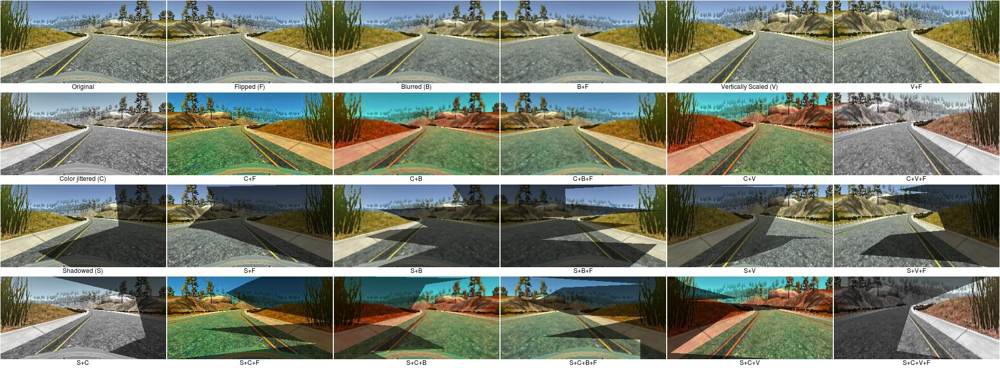

##Behavioral Cloning Project##

The goals / steps of this project are the following:
* Use the simulator to collect data of good driving behavior
* Build, a convolution neural network in Keras that predicts steering angles from images
* Train and validate the model with a training and validation set
* Test that the model successfully drives around track one without leaving the road
* Summarize the results with a written report

### Overview and project deliverables

My project includes the following files:
* model.py contains two models: one based on NVIDIA and another model based on COMMA.AI. I wanted to test how different models behave using the same training data.
* drive.py for driving the car in autonomous mode. It accepts a command line parameter for which model to load as well as an optional parameter to set the target speed (otherwise it detaults to 20 mph), e.g.

```sh
python drive.py nvidia.json 25
```

Once it connects to the simulator in autonomous mode, it outputs the predicted steering angle, speed, as well as prediction time (in milliseconds),  the time since the last frame -tele time-, as well as the net prediction fps:

* preprocess.py just includes common preprocessing code in Python but at the end I did included all preprocessing in the model itself. I left it in for future use.
* Trained models:
- comma.json/h5 contains the comma.ai model trained using centered, left-sided, right-sided and skewed driving (more on this later).
- nvidia.json/h5 contains the nvidia-inspired trained using centered, left-sided, right-sided and skewed driving.
- nvidia-centered.json/h5 same model trained only with centered driving.
- nvidia-centered-left-right.json/h5 same model trained with centered driving and left-sided and right-sided driving (but not skewed driving)
- nvidia-left-right.json.json/h5 same model trained only with left-sided and right-sided driving
- nvidia-left-right-skleft-skright.json.json/h5 same model trained with left-sided, right-sided and skewed driving
- readme.md (this file)

### Results

I managed to get track #1 and track #2 working at 30 mph. Click on the GIFs to see full-version on youtube.

[](https://www.youtube.com/watch?v=vDBoPAgClQo) [](https://www.youtube.com/watch?v=OOEopwAbZmw)

### 1. Training data
This project involved collecting good driving behavior from the Udacity simulator to train a neural network to learn to predict the steering angle. The simulator collects both the center image as seen inside car as well as left and right images.

#### Learning from good driving behavior
I collected "good" driving behavior driving in the center of the track. I collected a total of ~27k datapoints driving as best as I could.

Here's how the centered driving looks like (left, center and right cameras):


The train.py contains code to load the above training data and use the center, left and right cameras:

```
center_log   = read_log(args.centerdir, t = "c l r")
```

The read_log function will load the data and use all three cameras as indicated by "c l r". The steering angle is left as-is for the center camera and is corrected by configurable bias:

```
# takes CSV and outouts DF with 'image' and 'steering'
# adjust steering based on 'cb' (center bias) and lrb (left/right bias) 
# if applicable
def read_log(dir, t="c", cb=0., lrb=0.18):
```

In the code above the left / right bias defaults to 0.18. This bias controls how fast we want the car to get to a point ahead of the center camera. If the number is too low, the car will steer back to the center slowly; and if it's too high it will go back more quickly. 

The performance of the system where you run the simulator and the drive.py script severely impacts actual driving. If the computer is slow, the correction bias is high (e.g. 0.15 or more), and the speed is high (e.g. 20 mph) the car will end up driving in curves. This is because the steering angle will only be predicted and adjusted a few times per second so a really long straight line will be needed to stabilize the car. The drive.py outputs effective prediction fps to help diagnose performance issues:



Moreover, the steering angles output to the simulator are repeated either 2x or 3x. I believe there this is a bug in the simulator or drive.py supplied code and the frame gathered by the telemetry function is not updated on every call, so the net predictions per seconds are half or a third of those returned. In the output above, the reported 12 fps should be divided by 3: the steering prediction is repeated each time so the net speed at which the steering angle is adjusted is just 4 times per second! 

#### Augmented behavior: Learning from bad behavior

Although there's already implicit corrections made by using the left and right cameras, good driving is not enough: should a small error occur, the network will not know how to steer back to the center of the road:


The video above shows the car drives almost perfectly, however at a steep curve almost at the end it is unable to steer itself back to the center of the road.

Udacity suggested to record *recovering* driving behavior showing how to steer back to the center from a bad position.

Unfortunately the simulator makes it a bit difficult for one person alone to selectively record fragments of driving behavior, especially if using a gamepad: the simulator requires you to start/stop recording with the mouse while you control the car with a gamepad. I decided to use a different approach: record *bad behavior* and modify it in the same way the left/right cameras are adjusted to be useful as training material.

##### Learning from bad behavior: Sidewalk driving

I recorded left-sided driving: driving as best as possible with the car positioned as close as possible to the left line:


Conversely for right-sided driving:


For the left-sided driving I used the center and right cameras, both corrected to point to the center of the road with a steering bias of +0.5. The right-sided driving I used the center and left cameras with the equivalent correcting bias. As in the case of the left and right cameras, the correction bias indicates how quickly we want the car to steer itself back towards the center:

```
left_log     = read_log(args.leftdir,   t = "c r"  , cb =  0.5)
right_log    = read_log(args.rightdir,  t = "c l",   cb = -0.5)
```

##### Learning from more bad behavior: Skewed driving

Training the network with centered and sidewalk driving may be sufficient to get out from any position in which the car faces ahead; the training data  contains images where the car facing is parallel to the road. However should the car face the edge of the road in an oblique angle, correction may prove more difficult.

I recorded skewed-driving: driving from the center of the road trying to get out of the road, from center to the left:


and from center to the right:


In the same vein as as above, the skewed driving must be loaded with a steering correction bias, in this case I went with 0.7. Again, the bigger the value the quicker the car will steer back to the center as long as the overall end-to-end performance of the simulator and prediction pipeline is decent.

```
sk_left_log  = read_log(sk_left_dir,    t = "c l r", cb =  0.7)
sk_right_log = read_log(sk_right_dir,   t = "c l r", cb = -0.7)
```

The model.py file contains the code for training and saving the convolution neural network. The file shows the pipeline I used for training and validating the model, and it contains comments to explain how the code works.

###Model Architecture and Training Strategy

My model consists of an Nvidia-inspired convolution neural network with two 10x10 filters, followed by a 5x5 filter and two 3x3 filters and depths between 16 and 24; after flattening followed by 4 fully-connected layers with sizes between 64 and 8 (model.py lines 40-85). The network has ~70k trainable parameters.

The model includes RELU layers to introduce nonlinearity (code line 48), and the data is normalized in the model using a Keras lambda layer to perform minmax for each image:

```
def minmax_norm(x):
    xmin = K.min(x, axis=[1,2,3], keepdims=True)
    xmax = K.max(x, axis=[1,2,3], keepdims=True)
    
    return (x - xmin ) / (xmax-xmin) - 0.5
```

Using minmax should help generalizing when overall brightness changes as it normalizes the input to the network to be between -0.5 and +0.5 even for very dark images.

Instead of preprocessing images in Python, I opted to do cropping and downsampling in the model (lines 43-44).

I chose the Nvidia-inspired model since it was used for an almost identical problem and I tweaked it down to ~70k parameters. I believe the network could be further tuned down but this remains empirical.

#### Dropout

The model contains dropout layers in the fully connected layers in order to reduce overfitting (model.py lines 21). 

#### Model parameter tuning

The model used an Adam optimizer with a very low learning rate (1e-4), using the default Keras learning rate made the network diverge.

#### Training vs. Validation data

Training data was chosen to keep the vehicle driving on the road. I used a combination of center lane driving and corrected left-sided, right-sided and skewed lane driving for track #1, which was split in 80% training and 20% validation. Since I wanted to see how the network generalized to track #2 I added centered-driving track #2 to the validation set.

#### Balancing the training set

After the training set has been loaded, the histogram of the absolute value of steering angles looks like this:



The peaks require some explanation:

* 0: Most of the time the steering angle is very small.
* 0.18: Left and right cameras (corrected).
* 0.5: Left-sided and right-sided driving (corrected).
* 0.7: Skewed driving (corrected)

We need to balance the data (since we are using the MSE as the loss function), and I opted to limit to a maximum of 300 samples for each histogram bucket:



#### Keras generator

Since we cannot load all images in memory and we want to augment images, I used a Keras generator. For each training item, a total of 24 items are generated, using a combination of flipping, image scaling, blurring, color jittering and shadows:



The reason I used so many variations was to try to pass track #2 in fantastic mode, which contains shadows, slopes and the colors are not exactly as in track #1.

#### Training strategy

I trained my model for about ~120 epochs saving only the best performing model. Since the training set was balanced via undersampling, I decided to implement sequential rebalancing inspired by [this paper](http://cs.nju.edu.cn/zhouzh/zhouzh.files/publication/tsmcb09.pdf) to make sure as many training samples as possible are used while the labels are balanced. 

#### Misc

Training took ~20 hours on my GTX 1080 card but despite all augmentations it still cannot pass track #2 on fantastic mode:

[](https://www.youtube.com/watch?vhytT9AJL8IY)

Training without centered driving manages to get track #1 done:

[](https://www.youtube.com/watch?v=uOCIqdVYwOk)

GPU is only ~20% busy during training. It looks CPU is the bottleneck b/c of augmentations and possibly JPEG decompression.


