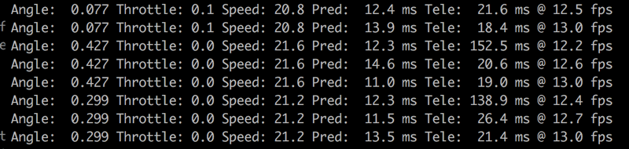

**Behavioral Cloning Project**

The goals / steps of this project are the following:
* Use the simulator to collect data of good driving behavior
* Build, a convolution neural network in Keras that predicts steering angles from images
* Train and validate the model with a training and validation set
* Test that the model successfully drives around track one without leaving the road
* Summarize the results with a written report

### Overview and project deliverables

My project includes the following files:
* model.py contains two models: one based on NVIDIA and another model based on COMMA.AI. I wanted to test how different models behave using the same training data.
* drive.py for driving the car in autonomous mode. It accepts a command line parameter for which model to load as well as an optional parameter to set the target speed (otherwise it detaults to 20 mph), e.g.
```sh
python drive.py nvidia.json 25
```
Once it connects to the simulator in autonomous mode, it outputs the predicted steering angle, speed, as well as prediction time (in milliseconds),  the time since the last frame -tele time-, as well as the net prediction fps:

* preprocess.py just includes common preprocessing code in Python but at the end I did included all preprocessing in the model itself. I left it in for future use.
* Trained models:
- comma.json/h5 contains the comma.ai model trained using centered, left-sided, right-sided and skewed driving (more on this later).
- nvidia.json/h5 contains the nvidia-inspired trained using centered, left-sided, right-sided and skewed driving.
- nvidia-centered.json/h5 same model trained only with centered driving.
- nvidia-centered-left-right.json/h5 same model trained with centered driving and left-sided and right-sided driving (but not skewed driving)
- nvidia-left-right.json.json/h5 same model trained only with left-sided and right-sided driving
- nvidia-left-right-skleft-skright.json.json/h5 same model trained with left-sided, right-sided and skewed driving
- readme.md (this file)

### Results

This video shows both track #1 and track #2 running in autonomous mode at full speed:
[](http://www.youtube.com/watch?v=RsCTkeEXxNU)


####1. Training data: behavioral cloning
This project involved collecting good driving behavior from the Udacity simulator to train a neural network to learn to predict the steering angle. The simulator collects both the center image as seen inside car as well as left and right images.

I collected "good" driving behavior driving in the center of the track. I collected a total of ~27k datapoints driving as best as I could.

Here's how the centered driving looks like (left, center and right cameras):


Using the Udacity provided simulator and my drive.py file, the car can be driven autonomously around the track by executing 
```sh
python drive.py model.h5
```

####3. Submission code is usable and readable

The model.py file contains the code for training and saving the convolution neural network. The file shows the pipeline I used for training and validating the model, and it contains comments to explain how the code works.

###Model Architecture and Training Strategy

####1. An appropriate model architecture has been employed

My model consists of a convolution neural network with 3x3 filter sizes and depths between 32 and 128 (model.py lines 18-24) 

The model includes RELU layers to introduce nonlinearity (code line 20), and the data is normalized in the model using a Keras lambda layer (code line 18). 

####2. Attempts to reduce overfitting in the model

The model contains dropout layers in order to reduce overfitting (model.py lines 21). 

The model was trained and validated on different data sets to ensure that the model was not overfitting (code line 10-16). The model was tested by running it through the simulator and ensuring that the vehicle could stay on the track.

####3. Model parameter tuning

The model used an adam optimizer, so the learning rate was not tuned manually (model.py line 25).

####4. Appropriate training data

Training data was chosen to keep the vehicle driving on the road. I used a combination of center lane driving, recovering from the left and right sides of the road ... 

For details about how I created the training data, see the next section. 

###Model Architecture and Training Strategy

####1. Solution Design Approach

The overall strategy for deriving a model architecture was to ...

My first step was to use a convolution neural network model similar to the ... I thought this model might be appropriate because ...

In order to gauge how well the model was working, I split my image and steering angle data into a training and validation set. I found that my first model had a low mean squared error on the training set but a high mean squared error on the validation set. This implied that the model was overfitting. 

To combat the overfitting, I modified the model so that ...

Then I ... 

The final step was to run the simulator to see how well the car was driving around track one. There were a few spots where the vehicle fell off the track... to improve the driving behavior in these cases, I ....

At the end of the process, the vehicle is able to drive autonomously around the track without leaving the road.

####2. Final Model Architecture

The final model architecture (model.py lines 18-24) consisted of a convolution neural network with the following layers and layer sizes ...

Here is a visualization of the architecture (note: visualizing the architecture is optional according to the project rubric)

![alt text][image1]

####3. Creation of the Training Set & Training Process

To capture good driving behavior, I first recorded two laps on track one using center lane driving. Here is an example image of center lane driving:

![alt text][image2]

I then recorded the vehicle recovering from the left side and right sides of the road back to center so that the vehicle would learn to .... These images show what a recovery looks like starting from ... :

![alt text][image3]
![alt text][image4]
![alt text][image5]

Then I repeated this process on track two in order to get more data points.

To augment the data sat, I also flipped images and angles thinking that this would ... For example, here is an image that has then been flipped:

![alt text][image6]
![alt text][image7]

Etc ....

After the collection process, I had X number of data points. I then preprocessed this data by ...


I finally randomly shuffled the data set and put Y% of the data into a validation set. 

I used this training data for training the model. The validation set helped determine if the model was over or under fitting. The ideal number of epochs was Z as evidenced by ... I used an adam optimizer so that manually training the learning rate wasn't necessary.
